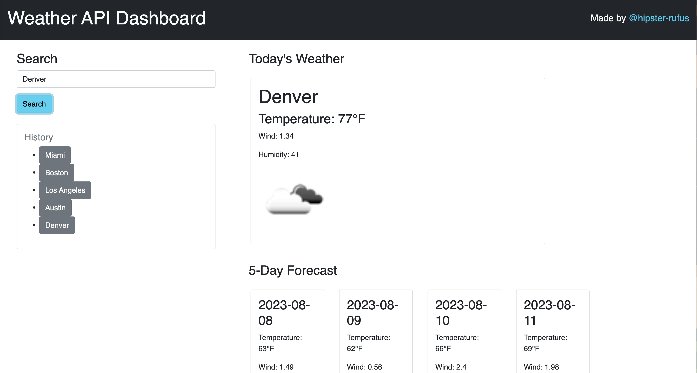

# silver-dollop-6

## Description
The Module 6 Challenge requires us to create a weather dashboard using the OpenWeather API

## Usage
To view and use my application, click on the link below: 
[My Weather Dashboard](https://hipster-rufus.github.io/silver-dollop-6)

The user is able to search for any US city and receive both a current weather status and a 5-day forecast. Each day displays the temperature, wind, humidity, and an icon displaying the cloud coverage. Their search history is collected below the search bar which they are able to use to return to previous searched cities. 

## Credits

The following websites were used to create this project:

[OpenWeather API](https://openweathermap.org/api)

[Bootstrap](https://getbootstrap.com/docs/5.3/getting-started/introduction/)

[MDN Web Docs: Web APIs](https://developer.mozilla.org/en-US/docs/Web/API/Node)

[W3 Schools: JS Tutorial](https://www.w3schools.com/js/default.asp)

## License

N/A